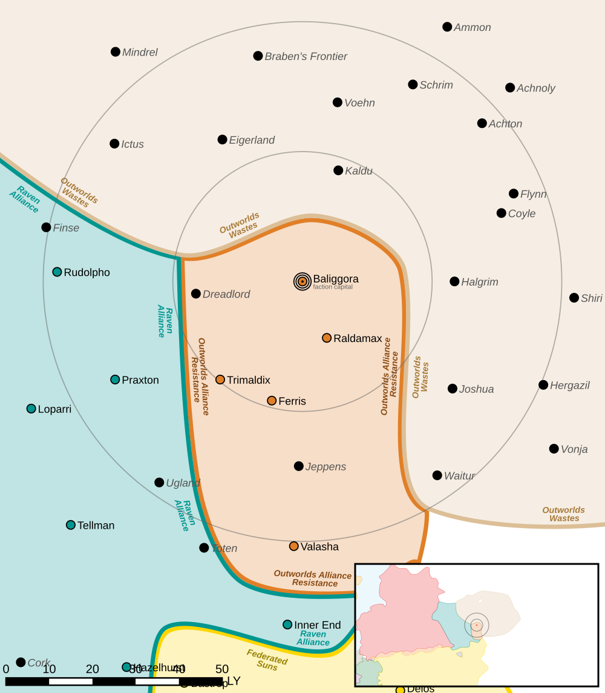

Baliggora
------------------------------------

Baliggora was one of the worlds that left the Outworlds Alliance after Clan Snow Raven attacked civilian ships over Dante.

Intelligence
^^^^^^^^^^^^^^^^^^^^^^^^^^^^^^^^^^^

Status: Seceded

Resistance Level: 6

Bounty Levels:

* None

Recruiting 
^^^^^^^^^^^^^^^^^^^^^^^^^^^^^^^^^^^

The following units can be purchased:

============ ====================== ===============
Level        Unit                   Cost
============ ====================== ===============
------------ ---------------------- ---------------
------------ ---------------------- ---------------
0            Flatbed Truck          ₵27.300
0            Flatbed Truck (Armor)  ₵51.450
0            Foot Squad (MG)        ₵218.244
0            Foot Squad (Rifle)     ₵127.530
0            Foot Squad (LRM)       ₵234.201
0            Foot Squad (SRM)       ₵292.623
------------ ---------------------- ---------------
------------ ---------------------- ---------------
------------ ---------------------- ---------------
1            Flatbed Truck (SRM)    ₵69.300
1            Flatbed Truck (Mortar) ₵99.750
1            Flatbed Truck (LRM)    ₵162.750
------------ ---------------------- ---------------
------------ ---------------------- ---------------
------------ ---------------------- ---------------
2            Light SRM Carrier      ₵824.200
2            GLN-1A MiningMech      ₵974.578
2            GLN-1B SecurityMech    ₵1.122.266
------------ ---------------------- ---------------
------------ ---------------------- ---------------
------------ ---------------------- ---------------
3            Browning Mobile HQ     ₵830.063
------------ ---------------------- ---------------
------------ ---------------------- ---------------
============ ====================== ===============

You can make purchases at the level corresponding to your reputation.

Planetary Data
^^^^^^^^^^^^^^^^^^^^^^^^^^^^^^^^^^^

* Sarna: `Baliggora article <https://www.sarna.net/wiki/Baliggora>`_
* Planet Type: Terrestrial
* Diameter: 10.800,0 km
* Position in System: 1 (0,120 AU)
* Time to Jump Point: 2,58 days
* Star type: M4V (205 hours)
* Year length: 0,5 Terran years
* Day length: 18,0 hours
* Surface Gravity: 0,97 g
* Atmosphere: Breathable
* Atmospheric Pressure: Standard
* Atmospheric Composition: Nitrogen and Oxygen, plus trace gasses
* Equatorial Temperature: 17C
* Surface Water: 41\%
* Highest Native Life: Fish
* Capital City: New Davistown
* Population: 123.288.370
* Socio-industrial Levels:
    * D: Lower-tech world; about 22nd century level
    * D: Low industrialization; about 20th century level
    * B: Mostly self-sufficient raw material production
    * F: None
    * D: Poor agriculture
* HPG: None
