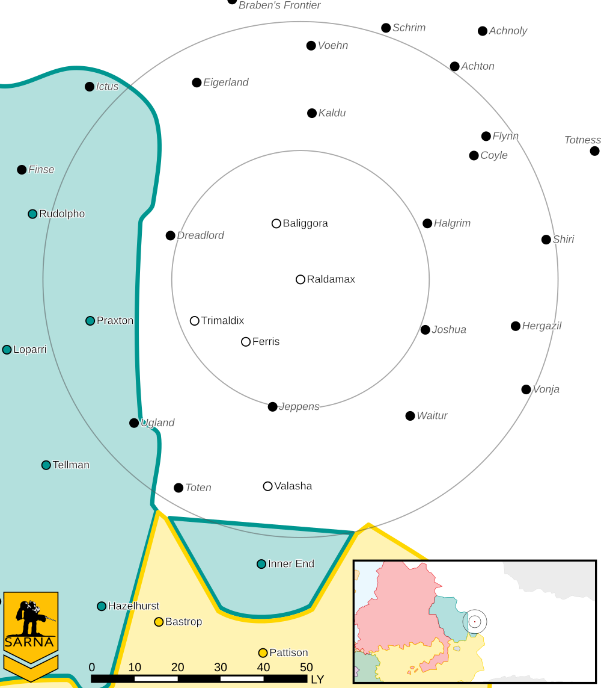

Raldamax
------------------------------------

Raldamax was one of the worlds that left the Outworlds Alliance after Clan Snow Raven attacked civilian ships over Dante.

Status: Seceded

* Sarna: `Raldamax article <https://www.sarna.net/wiki/Raldamax>`_
* Planet Type: Terrestrial
* Diameter: 13.800,0 km
* Position in System: 1 (0,080 AU)
* Time to Jump Point: 2,45 days
* Star type: M5V (205 hours)
* Year length: 0,4 Terran years
* Day length: 24,0 hours
* Surface Gravity: 1,25 g
* Atmosphere: Breathable
* Atmospheric Pressure: Standard
* Atmospheric Composition: Nitrogen and Oxygen, plus trace gasses
* Equatorial Temperature: 30C
* Surface Water: 72\%
* Highest Native Life: Amphibians
* Capital City: Newport Beach
* Population: 32.255.598
* Socio-industrial Levels:
    * C: Moderately advanced world
    * D: Low industrialization; about 20th century level
    * C: Limited raw material production
    * B: Good industrial output
    * C: Modest agriculture
* HPG: None
