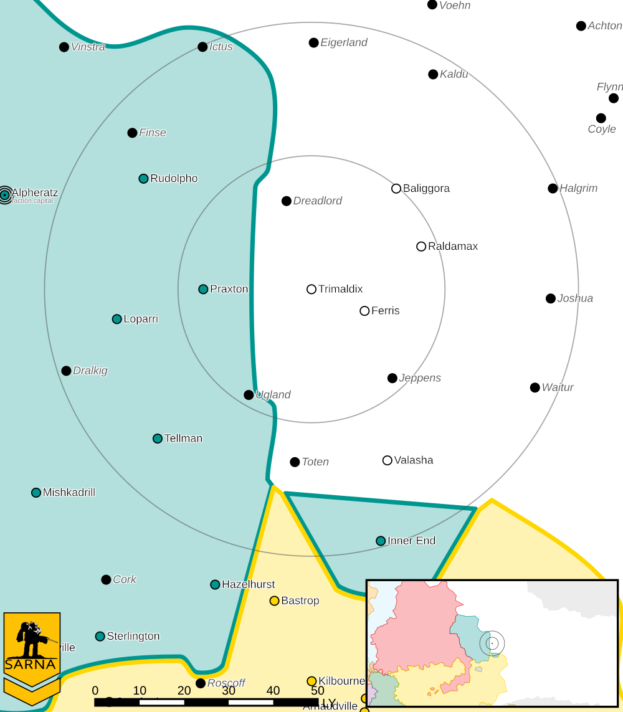

Trimaldix
------------------------------------

Trimaldix was one of the worlds that left the Outworlds Alliance after Clan Snow Raven attacked civilian ships over Dante.

* Sarna: `Trimaldix article <https://www.sarna.net/wiki/Trimaldix>`_
* Planet Type: Terrestrial
* Diameter: 12.600,0 km
* Position in System: 2 (0,700 AU)
* Time to Jump Point: 8,53 days
* Star type: G3V (184 hours)
* Year length: 1,2 Terran years
* Day length: 26,0 hours
* Surface Gravity: 1,23 g
* Atmosphere: Breathable
* Atmospheric Pressure: Thin
* Atmospheric Composition: Nitrogen and Oxygen, plus trace gasses
* Equatorial Temperature: 37C
* Surface Water: 24\%
* Highest Native Life: Reptiles
* Capital City: New Zaccanopoli
* Population: 12.432.343
* Socio-industrial Levels:
    * D: Lower-tech world; about 22nd century level
    * C: Basic heavy industry; about 22nd century level
    * B: Mostly self-sufficient raw material production
    * D: Negligible industrial output
    * C: Modest agriculture
* HPG: None
