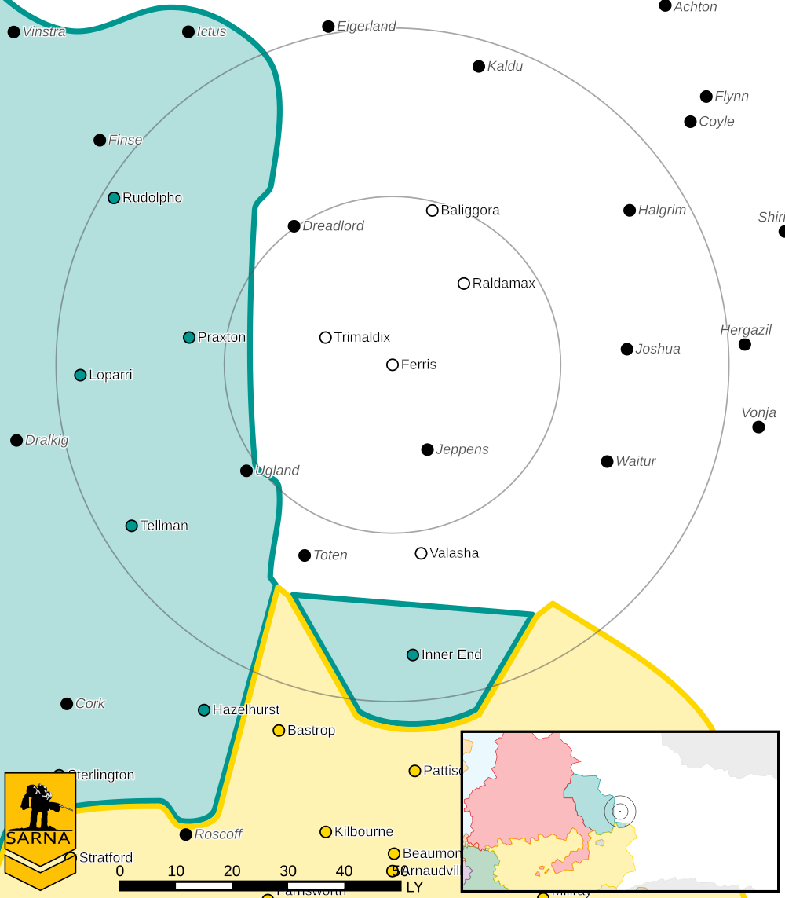

Ferris
------------------------------------

Ferris was one of the worlds that left the Outworlds Alliance after Clan Snow Raven attacked civilian ships over Dante.

A former Alliance Military Corps training facility for MechWarriors, tankers, and conventional infantry is on Ferris.
The facility is attempting to rebuild its aerospace fighter training program.

Intelligence 
^^^^^^^^^^^^^^^^^^^^^^^^^^^^^^^^^^^

Status: Seceded

Bonus: *Train* at half cost

Planetary Data
^^^^^^^^^^^^^^^^^^^^^^^^^^^^^^^^^^^

* Sarna: `Ferris article <https://www.sarna.net/wiki/Ferris_(OA)>`_
* Planet Type: Terrestrial
* Diameter: 14.101,0 km
* Position in System: 2 (0,630 AU)
* Time to Jump Point: 7,03 days
* Star type: G6V (187 hours)
* Year length: 1,1 Terran years
* Day length: 25,0 hours
* Surface Gravity: 1,04 g
* Atmosphere: Breathable
* Atmospheric Pressure: Standard
* Atmospheric Composition: Nitrogen and Oxygen, plus trace gasses
* Equatorial Temperature: 37C
* Surface Water: 37\%
* Highest Native Life: Reptiles
* Capital City: Chicago
* Population: 12.432.343
* Socio-industrial Levels:
    * C: Moderately advanced world
    * B: Moderately industrialized
    * C: Limited self-sufficient raw material production
    * C: Limited industrial output
    * B: Agriculturally abundant world
* HPG: Class B
