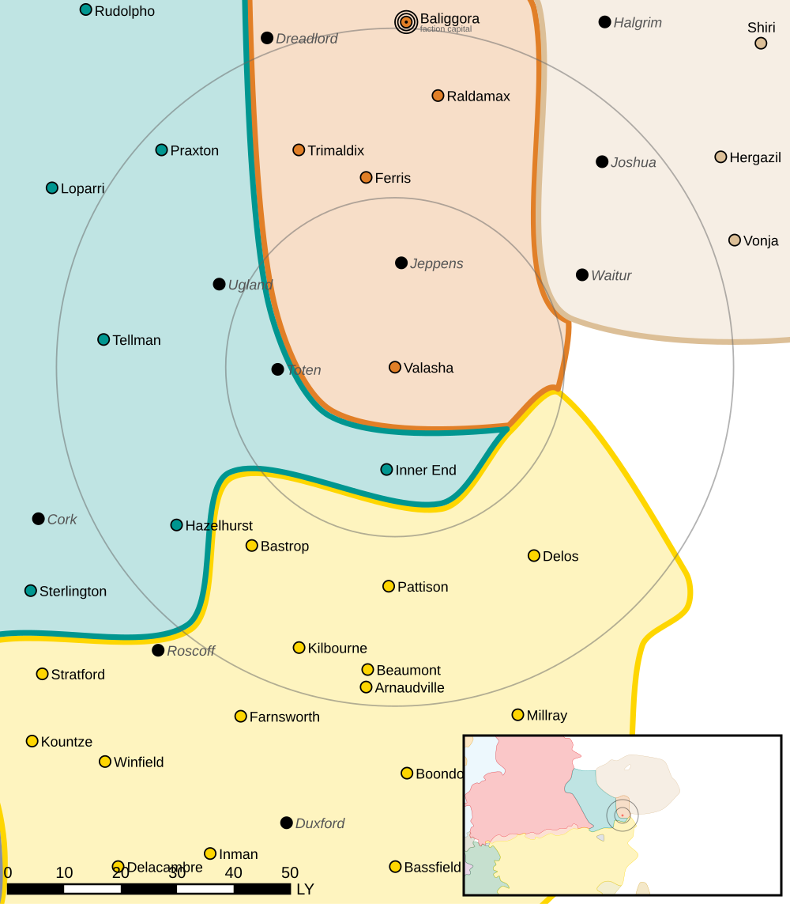

Valasha
------------------------------------

Valasha was one of the worlds that left the Outworlds Alliance after Clan Snow Raven attacked civilian ships over Dante.

Intelligence 
^^^^^^^^^^^^^^^^^^^^^^^^^^^^^^^^^^^

Status: Seceded

Resistance Level: 0

Bounty Levels:

* None

Recruiting 
^^^^^^^^^^^^^^^^^^^^^^^^^^^^^^^^^^^

The following units can be purchased:

============ =========================== ===============
Level        Unit                        Cost
============ =========================== ===============
------------ --------------------------- ---------------
------------ --------------------------- ---------------
0            Flatbed Truck               ₵27.300
0            Flatbed Truck (Armor)       ₵51.450
0            Foot Squad (MG)             ₵218.244
0            Foot Squad (Rifle)          ₵127.530
0            Foot Squad (LRM)            ₵234.201
0            Foot Squad (SRM)            ₵292.623
------------ --------------------------- ---------------
------------ --------------------------- ---------------
------------ --------------------------- ---------------
1            Flatbed Truck (SRM)         ₵69.300
1            Flatbed Truck (Mortar)      ₵99.750
1            Flatbed Truck (LRM)         ₵162.750
------------ --------------------------- ---------------
------------ --------------------------- ---------------
------------ --------------------------- ---------------
2            Light SRM Carrier           ₵824.200
2            GLN-1A MiningMech           ₵974.578
2            GLN-1B SecurityMech         ₵1.122.266
------------ --------------------------- ---------------
------------ --------------------------- ---------------
------------ --------------------------- ---------------
3            BattleMech Recovery Vehicle ₵392.917
------------ --------------------------- ---------------
------------ --------------------------- ---------------
============ =========================== ===============

You can make purchases at the level corresponding to your reputation.

Planetary Data
^^^^^^^^^^^^^^^^^^^^^^^^^^^^^^^^^^^

* Sarna: `Valasha article <https://www.sarna.net/wiki/Valasha>`_
* Planet Type: Terrestrial
* Diameter: 10.800,0 km
* Position in System: 1 (3,570 AU)
* Time to Jump Point: 39.38 days
* Star type: A3V (164 hours)
* Year length: 1,1 Terran years
* Day length: 25,0 hours
* Surface Gravity: 0,61 g
* Atmosphere: Breathable
* Atmospheric Pressure: Standard
* Atmospheric Composition: Nitrogen and Oxygen, plus trace gasses
* Equatorial Temperature: 14C
* Surface Water: 53\%
* Highest Native Life: Reptiles
* Capital City: New Porrera
* Population: 50.737.496
* Socio-industrial Levels:
    * B: Advanced world
    * D: Low industrialization; about 20th century level
    * B: Mostly self-sufficient raw material production
    * D: Negligible industrial output
    * C: Modest agriculture
* HPG: None
