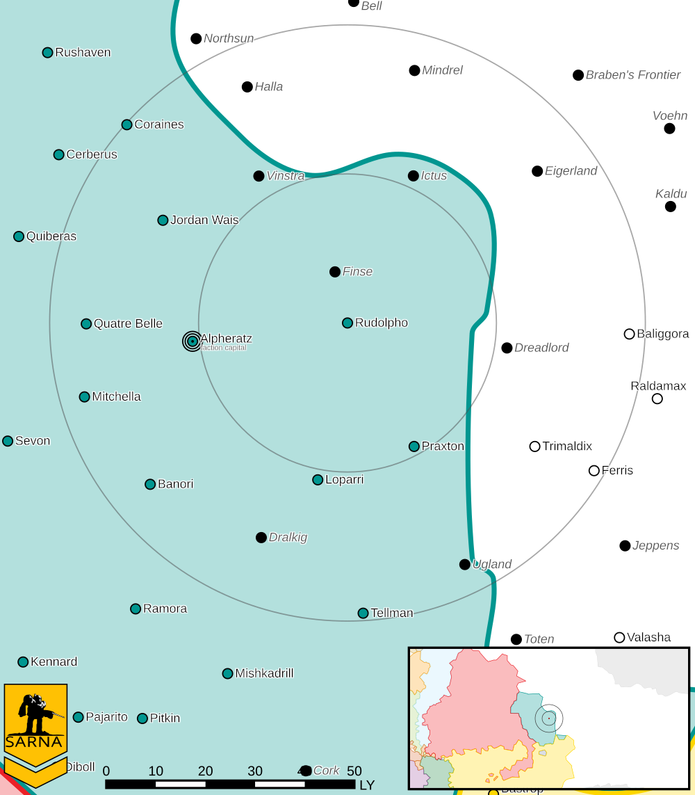

Rudolpho
------------------------------------

The Second Alliance Air Wing command regiment was stationed on Rudolpho until it was assigned to the Clan Snow Raven Terran task force.

Intelligence 
^^^^^^^^^^^^^^^^^^^^^^^^^^^^^^^^^^^

Status: Raven Alliance held

Forces:

* `2nd Alliance Air Wing <https://www.sarna.net/wiki/2nd_Alliance_Air_Wing>`_ (Deployed)

Planetary Data
^^^^^^^^^^^^^^^^^^^^^^^^^^^^^^^^^^^

* Sarna: `Rudolpho article <https://www.sarna.net/wiki/Rudolpho>`_
* Planet Type: Terrestrial
* Diameter: 14.100,0 km
* Position in System: 1 (0,280 AU)
* Time to Jump Point: 4,36 days
* Star type: K4V (195 hours)
* Year length: 0,8 Terran years
* Day length: 27,0 hours
* Surface Gravity: 1,27 g
* Atmosphere: Breathable
* Atmospheric Pressure: Thin
* Atmospheric Composition: Nitrogen and Oxygen, plus trace gasses
* Equatorial Temperature: 34C
* Surface Water: 37\%
* Highest Native Life: Reptiles
* Capital City: Correntina
* Population: 47.7793.111
* Socio-industrial Levels:
    * C: Moderately advanced world
    * B: Moderately industrialized
    * B: Mostly self-sufficient raw material production
    * B: Good industrial output
    * D: Poor agriculture
* HPG: None
