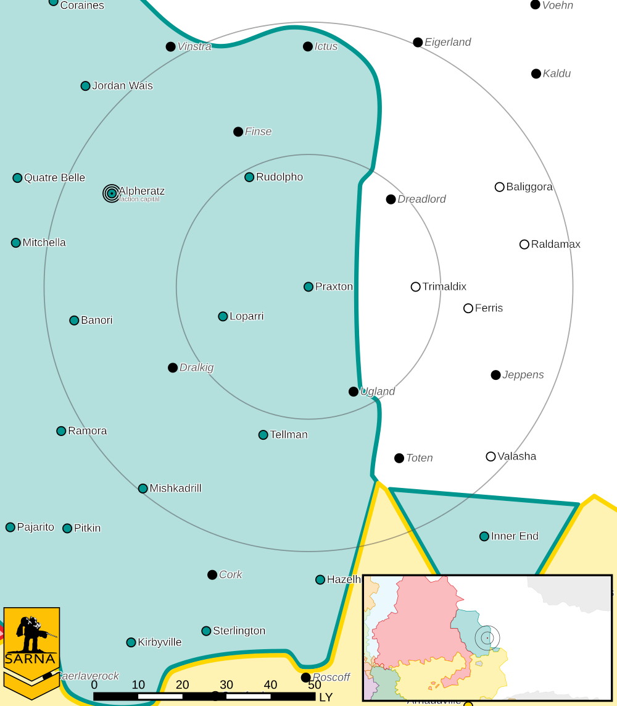

Praxton
------------------------------------

The First Alliance Air Wing command regiment is stationed on Praxton.
Praxton Fusion Products Limited, which produces fusion engines for BattleMechs, is located on Praxton.
`Eustace Avellar <https://www.sarna.net/wiki/Eustace_Avellar>`_ disappeared after visiting  Loparri and Paxton on his morale building tour.
He was being monitored by the Raven Watch for his ties to anti-Raven groups.

Intelligence 
^^^^^^^^^^^^^^^^^^^^^^^^^^^^^^^^^^^

Status: Raven Alliance held

Forces:

* `1st Alliance Air Wing <https://www.sarna.net/wiki/1st_Alliance_Air_Wing>`_

Planetary Data
^^^^^^^^^^^^^^^^^^^^^^^^^^^^^^^^^^^

* Sarna: `Praxton article <https://www.sarna.net/wiki/Praxton>`_
* Planet Type: Terrestrial
* Diameter: 12.705,0 km
* Position in System: 1 (0,200 AU)
* Time to Jump Point: 3,00 days
* Star type: M1V (202 hours)
* Recharge station: Nadir
* Year length: 0,7 Terran years
* Day length: 25,0 hours
* Surface Gravity: 0,95 g
* Atmosphere: Breathable
* Atmospheric Pressure: Thin
* Atmospheric Composition: Nitrogen and Oxygen, plus trace gasses
* Equatorial Temperature: 37C
* Surface Water: 16\%
* Highest Native Life: Reptiles
* Capital City: LeBrock
* Population: 885.084.410
* Socio-industrial Levels:
    * C: Moderately advanced world
    * B: Moderately industrialized
    * C: Limited raw material production
    * C: Limited industrial output
    * C: Modest agriculture
* HPG: None
