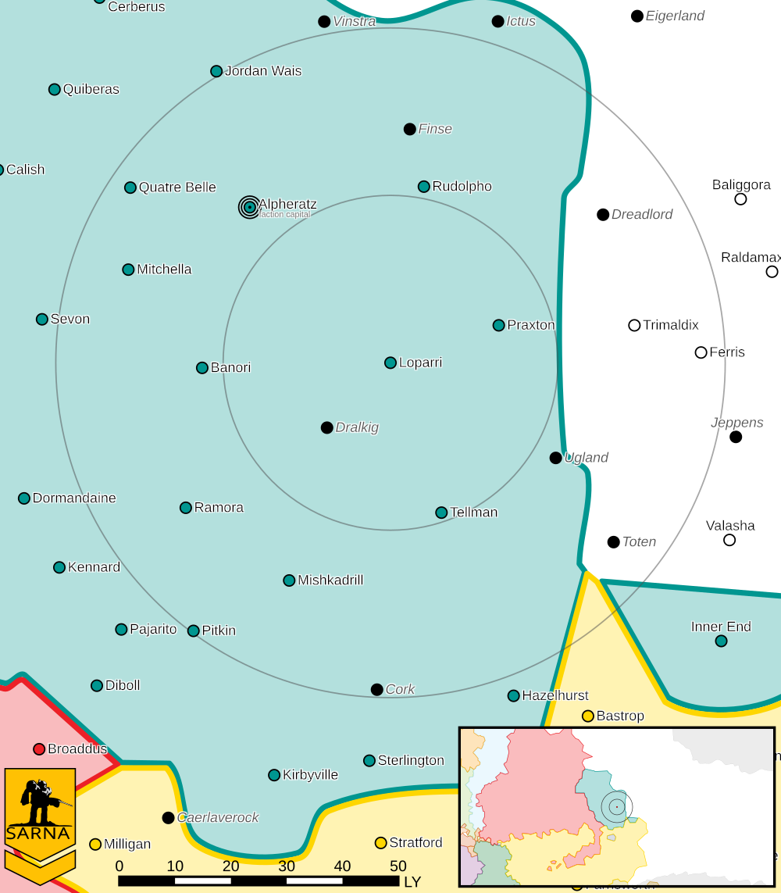

Loparri
------------------------------------

Loparri was targeted by General Forlough for seek-and-destroy missions to weaken industry and population centers.

* Sarna: `Loparri article <https://www.sarna.net/wiki/Loparri>`_
* Planet Type: Terrestrial
* Diameter: 11.700,0 km
* Position in System: 2 (0,700 AU)
* Time to Jump Point: 8,53 days
* Star type: G3V (184 hours)
* Year length: 1,2 Terran years
* Day length: 26,0 hours
* Surface Gravity: 1,14 g
* Atmosphere: Breathable
* Atmospheric Pressure: High
* Atmospheric Composition: Nitrogen and Oxygen, plus trace gasses
* Equatorial Temperature: 42C
* Surface Water: 32\%
* Highest Native Life: Insects
* Capital City: Laidler City
* Population: 48.486.138
* Socio-industrial Levels:
    * A: High-tech world
    * B: Moderately industrialized
    * A: Fully self-sufficient raw material production
    * C: Limited industrial output
    * A: Breadbasket
* HPG: None
