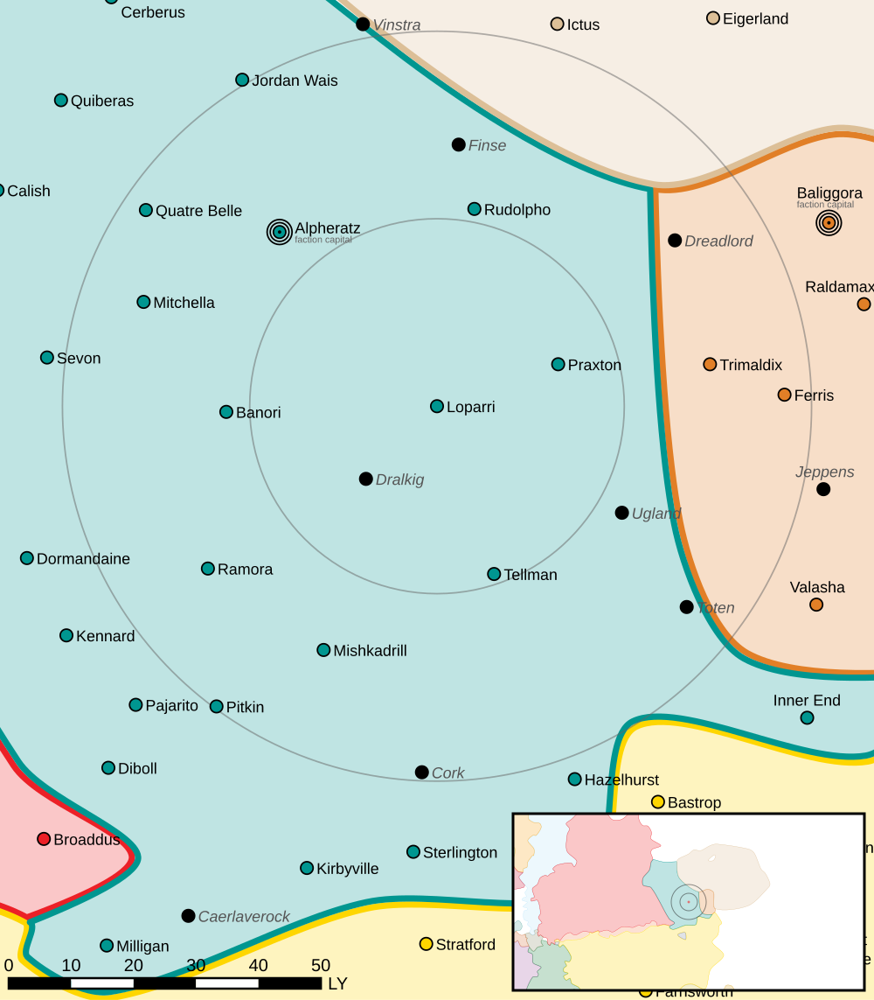

Loparri
------------------------------------

Loparri was targeted by General Forlough for seek-and-destroy missions to weaken industry and population centers.
`Eustace Avellar <https://www.sarna.net/wiki/Eustace_Avellar>`_ disappeared after visiting  Loparri and Paxton on his morale building tour.
He was being monitored by the Raven Watch for his ties to anti-Raven groups. 

Intelligence
^^^^^^^^^^^^^^^^^^^^^^^^^^^^^^^^^^^

Status: Raven Alliance held

Resistance Level: 0

Bounty Levels:

* None

Recruiting 
^^^^^^^^^^^^^^^^^^^^^^^^^^^^^^^^^^^

The following units can be purchased:

============ ====================== ===============
Level        Unit                   Cost
============ ====================== ===============
------------ ---------------------- ---------------
------------ ---------------------- ---------------
0            Flatbed Truck          ₵27.300
0            Flatbed Truck (Armor)  ₵51.450
0            Foot Squad (MG)        ₵218.244
0            Foot Squad (Rifle)     ₵127.530
0            Foot Squad (LRM)       ₵234.201
0            Foot Squad (SRM)       ₵292.623
------------ ---------------------- ---------------
------------ ---------------------- ---------------
------------ ---------------------- ---------------
1            Flatbed Truck (SRM)    ₵69.300
1            Flatbed Truck (Mortar) ₵99.750
1            Flatbed Truck (LRM)    ₵162.750
------------ ---------------------- ---------------
------------ ---------------------- ---------------
============ ====================== ===============

You can make purchases at the level corresponding to the smaller of your reputation and the local system resistance level.

Planetary Data
^^^^^^^^^^^^^^^^^^^^^^^^^^^^^^^^^^^

* Sarna: `Loparri article <https://www.sarna.net/wiki/Loparri>`_
* Planet Type: Terrestrial
* Diameter: 11.700,0 km
* Position in System: 2 (0,700 AU)
* Time to Jump Point: 8,53 days
* Star type: G3V (184 hours)
* Year length: 1,2 Terran years
* Day length: 26,0 hours
* Surface Gravity: 1,14 g
* Atmosphere: Breathable
* Atmospheric Pressure: High
* Atmospheric Composition: Nitrogen and Oxygen, plus trace gasses
* Equatorial Temperature: 42C
* Surface Water: 32\%
* Highest Native Life: Insects
* Capital City: Laidler City
* Population: 48.486.138
* Socio-industrial Levels:
    * A: High-tech world
    * B: Moderately industrialized
    * A: Fully self-sufficient raw material production
    * C: Limited industrial output
    * A: Breadbasket
* HPG: None
