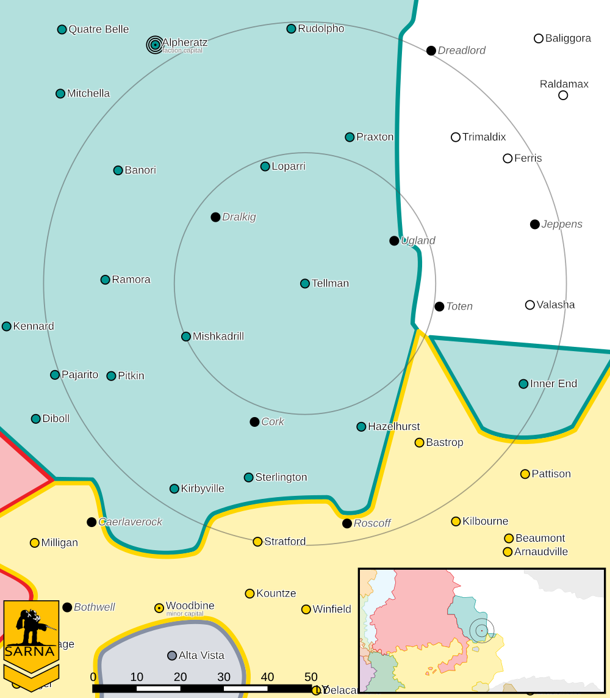

Tellman
------------------------------------

The First Alliance Air Wing second and third regiments are stationed on Praxton.

Tellman IV is the site of the Day of Vengeance, an important battle in the Reunification War where the Pitcairn Legion defeated General Forlough's V Corps and forced them to retreat.
`Eustace Avellar <https://www.sarna.net/wiki/Eustace_Avellar>`_ disappeared en-route to Tellman on his morale building tour.
He was being monitored by the Raven Watch for his ties to anti-Raven groups.

Intelligence
^^^^^^^^^^^^^^^^^^^^^^^^^^^^^^^^^^^

Status: Raven Alliance held

Forces:

* `1st Alliance Air Wing <https://www.sarna.net/wiki/1st_Alliance_Air_Wing>`_

Resistance Level: 0

Bounty Levels:

* None

Recruiting 
^^^^^^^^^^^^^^^^^^^^^^^^^^^^^^^^^^^

The following units can be purchased:

============ ==============         ===============
Level        Unit                   Cost
============ ==============         ===============
0            Flatbed Truck          ₵27,300
0            Foot Squad (MG)        ₵218,244
0            Foot Squad (Rifle)     ₵127,530
0            Foot Squad (LRM)       ₵234,201
1            Foot Squad (SRM)       ₵292,623
1            Flatbed Truck (Armor)  ₵51,450
1            Flatbed Truck (SRM)    ₵69,300
1            Flatbed Truck (Mortar) ₵99,750
1            Flatbed Truck (LRM)    ₵162,750
============ ==============         ===============

You can make purchases at the level corresponding to the smaller of your reputation and the local system resistance level.

Planetary Data
^^^^^^^^^^^^^^^^^^^^^^^^^^^^^^^^^^^

* Sarna: `Tellman article <https://www.sarna.net/wiki/Tellman>`_
* Planet Type: Terrestrial
* Diameter: 13.200,0 km
* Position in System: 4 (1,760 AU)
* Time to Jump Point: 10,48 days
* Star type: G0V (181 hours)
* Year length: 2,6 Terran years
* Day length: 28,0 hours
* Surface Gravity: 0,99 g
* Atmosphere: Breathable
* Atmospheric Pressure: Thin
* Atmospheric Composition: Nitrogen and Oxygen, plus trace gasses
* Equatorial Temperature: 22C
* Surface Water: 65\%
* Highest Native Life: Amphibians
* Capital City: Tellman IV City
* Population: 71.723.106
* Socio-industrial Levels:
    * D: Lower-tech world; about 21st century level
    * D: Low industrialization; about 20th century level
    * B: Mostly self-sufficient raw material production
    * D: Negligible industrial output
    * B: Agriculturally abundant world
* HPG: None
