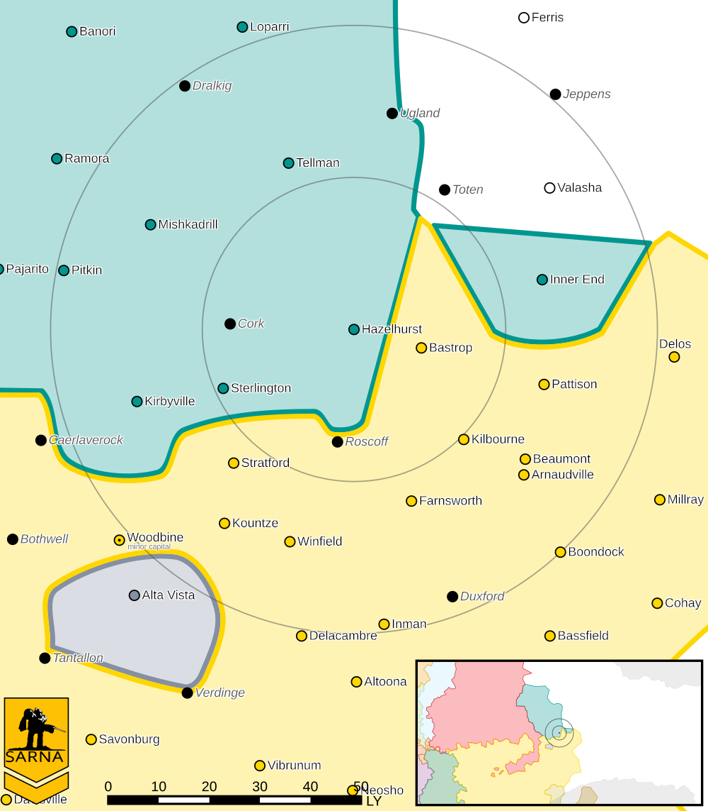

Hazelhurst
------------------------------------

The Alliance Naval Star, 3rd Raven Auxiliaries, and 11th Raven Wing Cluster are stationed in Hazelhurst.

Intelligence
^^^^^^^^^^^^^^^^^^^^^^^^^^^^^^^^^^^

Status: Raven Alliance held

Forces:

* `Alliance Naval Star <https://www.sarna.net/wiki/Alliance_Naval_Star_(Clan_Snow_Raven)>`_
* `3rd Raven Auxiliaries <https://www.sarna.net/wiki/Third_Raven_Auxiliaries_(Clan_Snow_Raven)>`_
* `11th Raven Wing Cluster <https://www.sarna.net/wiki/Eleventh_Raven_Wing_(Clan_Snow_Raven)>`_

Resistance Level: 0

Bounty Levels:

* None

Recruiting 
^^^^^^^^^^^^^^^^^^^^^^^^^^^^^^^^^^^

The following units can be purchased:

============ ==============         ===============
Level        Unit                   Cost
============ ==============         ===============
0            Flatbed Truck          ₵27,300
0            Foot Squad (MG)        ₵218,244
0            Foot Squad (Rifle)     ₵127,530
1            Foot Squad (LRM)       ₵234,201
1            Foot Squad (SRM)       ₵292,623
1            Flatbed Truck (Armor)  ₵51,450
1            Flatbed Truck (SRM)    ₵69,300
1            Flatbed Truck (Mortar) ₵99,750
1            Flatbed Truck (LRM)    ₵162,750
============ ==============         ===============

You can make purchases at the level corresponding to the smaller of your reputation and the local system resistance level.

Planetary Data
^^^^^^^^^^^^^^^^^^^^^^^^^^^^^^^^^^^

* Sarna: `Hazelhurst article <https://www.sarna.net/wiki/Hazelhurst>`_
* Planet Type: Terrestrial
* Diameter: 10.800,0 km
* Position in System: 1 (0,160 AU)
* Time to Jump Point: 2,85 days
* Star type: M2V (203 hours)
* Year length: 0,6 Terran years
* Day length: 23,0 hours
* Surface Gravity: 0,61 g
* Atmosphere: Breathable
* Atmospheric Pressure: Standard
* Atmospheric Composition: Nitrogen and Oxygen, plus trace gasses
* Equatorial Temperature: 29C
* Surface Water: 51\%
* Highest Native Life: Birds
* Capital City: Smeeth
* Population: 48.496.639
* Socio-industrial Levels:
    * C: Moderately advanced world
    * C: Basic heavy industry; about 22nd century level
    * B: Mostly self-sufficient raw material production
    * C: Limited industrial output
    * C: Modest agriculture
* HPG: None
