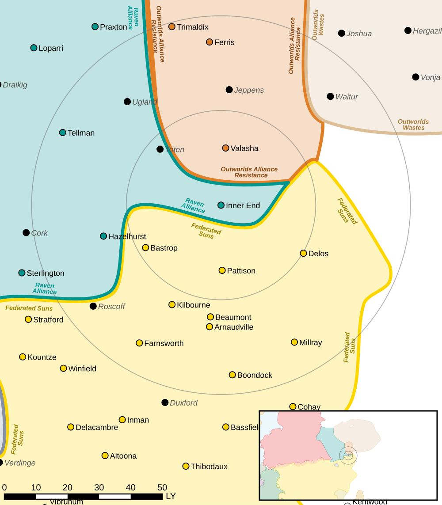

Inner End
------------------------------------

Originally given to the Federated Suns by the Outworlds Alliance as part of the Tancredi Accord in exchange for military aid during the Reunification Wars.
Clan Snow Raven conquered Inner End, along with Haynesville and Diboll, in 3144.

Clan Snow Raven  Gamma Galaxy, 100th and 121st Raven Battle Clusters are stationed on Inner End.

Intelligence
^^^^^^^^^^^^^^^^^^^^^^^^^^^^^^^^^^^

Status: Raven Alliance held

Forces:

* `100th Raven Battle Cluster <https://www.sarna.net/wiki/100th_Raven_Battle_(Clan_Snow_Raven)>`_
* `121st Raven Battle Cluster <https://www.sarna.net/wiki/121st_Raven_Battle_(Clan_Snow_Raven)>`_

Resistance Level: 0

Bounty Levels:

* None

Recruiting 
^^^^^^^^^^^^^^^^^^^^^^^^^^^^^^^^^^^

The following units can be purchased:

============ ====================== ===============
Level        Unit                   Cost
============ ====================== ===============
------------ ---------------------- ---------------
------------ ---------------------- ---------------
0            Flatbed Truck          ₵27,300
0            Foot Squad (MG)        ₵218,244
0            Foot Squad (Rifle)     ₵127,530
------------ ---------------------- ---------------
------------ ---------------------- ---------------
------------ ---------------------- ---------------
1            Foot Squad (LRM)       ₵234,201
1            Foot Squad (SRM)       ₵292,623
1            Flatbed Truck (Armor)  ₵51,450
1            Flatbed Truck (SRM)    ₵69,300
1            Flatbed Truck (Mortar) ₵99,750
1            Flatbed Truck (LRM)    ₵162,750
------------ ---------------------- ---------------
------------ ---------------------- ---------------
============ ====================== ===============

Planetary Data
^^^^^^^^^^^^^^^^^^^^^^^^^^^^^^^^^^^

* Sarna: `Inner End article <https://www.sarna.net/wiki/Inner_End>`_
* Planet Type: Terrestrial
* Diameter: 12.300,0 km
* Position in System: 1 (0,80 AU)
* Time to Jump Point: 2,45 days
* Star type: M5V (1206 hours)
* Year length: 0,4 Terran years
* Day length: 26,0 hours
* Surface Gravity: 0,92 g
* Atmosphere: Breathable
* Atmospheric Pressure: Standard
* Atmospheric Composition: Nitrogen and Oxygen, plus trace gasses
* Equatorial Temperature: 34C
* Surface Water: 38\%
* Highest Native Life: Fish
* Capital City: Morgan
* Population: 48.789.035
* Socio-industrial Levels:
    * C: Moderately advanced world
    * D: Low industrialization; about 20th century level
    * A: Fully self-sufficient raw material production
    * D: Negligible industrial output
    * F: Barren world
* HPG: None
