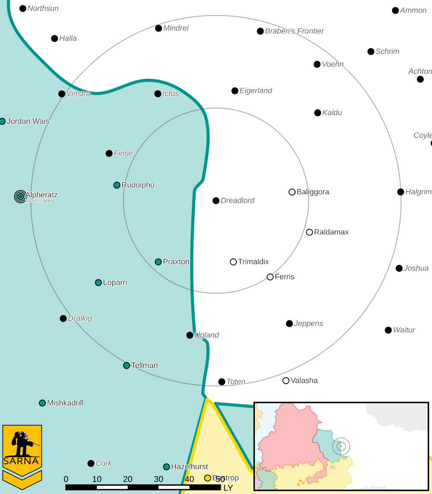

Dreadlord
------------------------------------

This world is considered abandoned.

* Sarna: `Dreadlord article <https://www.sarna.net/wiki/Dreadlord>`_
* Planet Type: Terrestrial
* Diameter: 12.900,0 km
* Position in System: 4 (2,080 AU)
* Time to Jump Point: 12,93 days
* Star type: F7V (178 hours)
* Year length: 3,2 Terran years
* Day length: 23,0 hours
* Surface Gravity: 0,86 g
* Atmosphere: Breathable
* Atmospheric Pressure: Standard
* Atmospheric Composition: Nitrogen and Oxygen, plus trace gasses
* Equatorial Temperature: 16C
* Surface Water: 43\%
* Highest Native Life: Amphibions
* Capital City: Rea
* Population: 0
* Socio-industrial Levels:
    * Regressed: Pre-industrial world
    * X: None
    * X: None
    * X: None
    * X: None
* HPG: None
