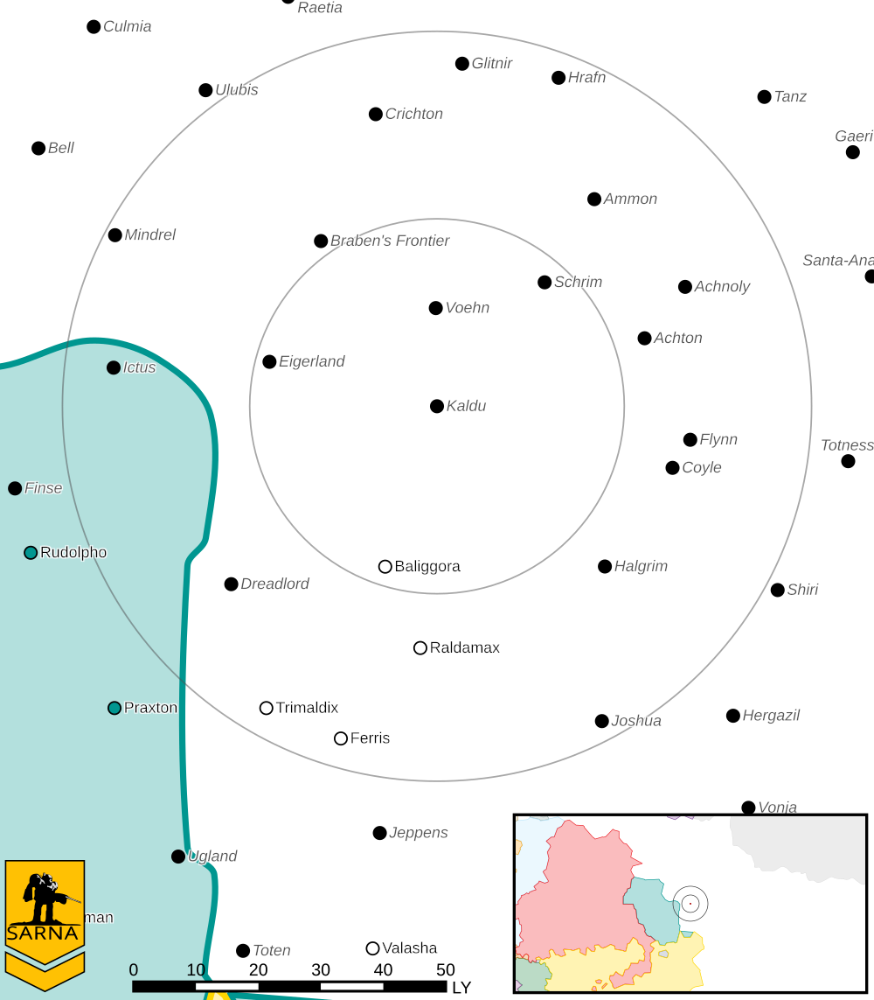

Kaldu
------------------------------------

This world is considered abandoned.

Status: Abandoned world

* Sarna: `Kaldu article <https://www.sarna.net/wiki/Kaldu>`_
* Planet Type: Terrestrial
* Diameter: 12.600,0 km
* Position in System: 4 (2,240 AU)
* Time to Jump Point: 12,93 days
* Star type: F5V (176 hours)
* Year length: 3,6 Terran years
* Day length: 20,0 hours
* Surface Gravity: 1,14 g
* Atmosphere: Breathable
* Atmospheric Pressure: Thin
* Atmospheric Composition: Nitrogen and Oxygen, plus trace gasses
* Equatorial Temperature: 36C
* Surface Water: 52\%
* Highest Native Life: Reptiles
* Capital City: New Westford
* Population: 0
* Socio-industrial Levels:
    * Regressed: Pre-industrial world
    * X: None
    * X: None
    * X: None
    * X: None
* HPG: None
