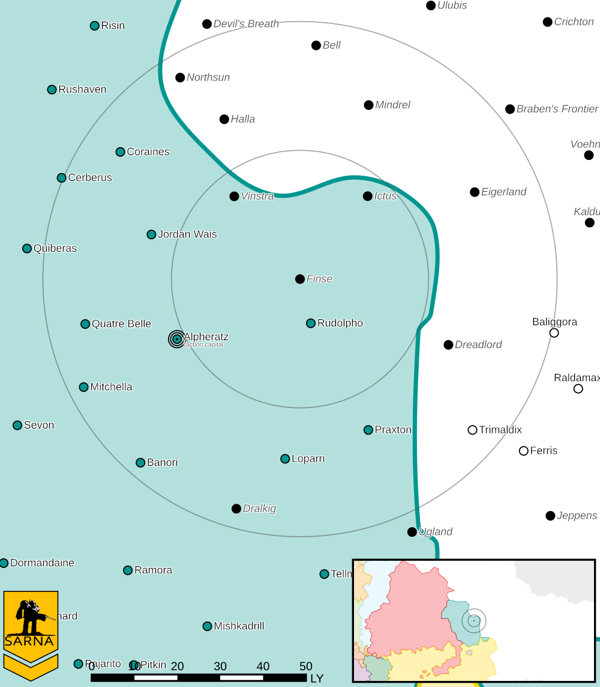

Finse
------------------------------------

This world is considered abandoned.

Intelligence
^^^^^^^^^^^^^^^^^^^^^^^^^^^^^^^^^^^

Status: Abandoned world

Planetary Data
^^^^^^^^^^^^^^^^^^^^^^^^^^^^^^^^^^^

* Sarna: `Finse article <https://www.sarna.net/wiki/Finse>`_
* Planet Type: Terrestrial
* Diameter: 11.100,0 km
* Position in System: 1 (0,280 AU)
* Time to Jump Point: 4,61 days
* Star type: K3V (194 hours)
* Year length: 0,8 Terran years
* Day length: 20,0 hours
* Surface Gravity: 0,74 g
* Atmosphere: Breathable
* Atmospheric Pressure: Thin
* Atmospheric Composition: Nitrogen and Oxygen, plus trace gasses
* Equatorial Temperature: 36C
* Surface Water: 25\%
* Highest Native Life: Reptiles
* Capital City: Oksfjord
* Population: 0
* Socio-industrial Levels:
    * Regressed: Pre-industrial world
    * X: None
    * X: None
    * X: None
    * X: None
* HPG: None
