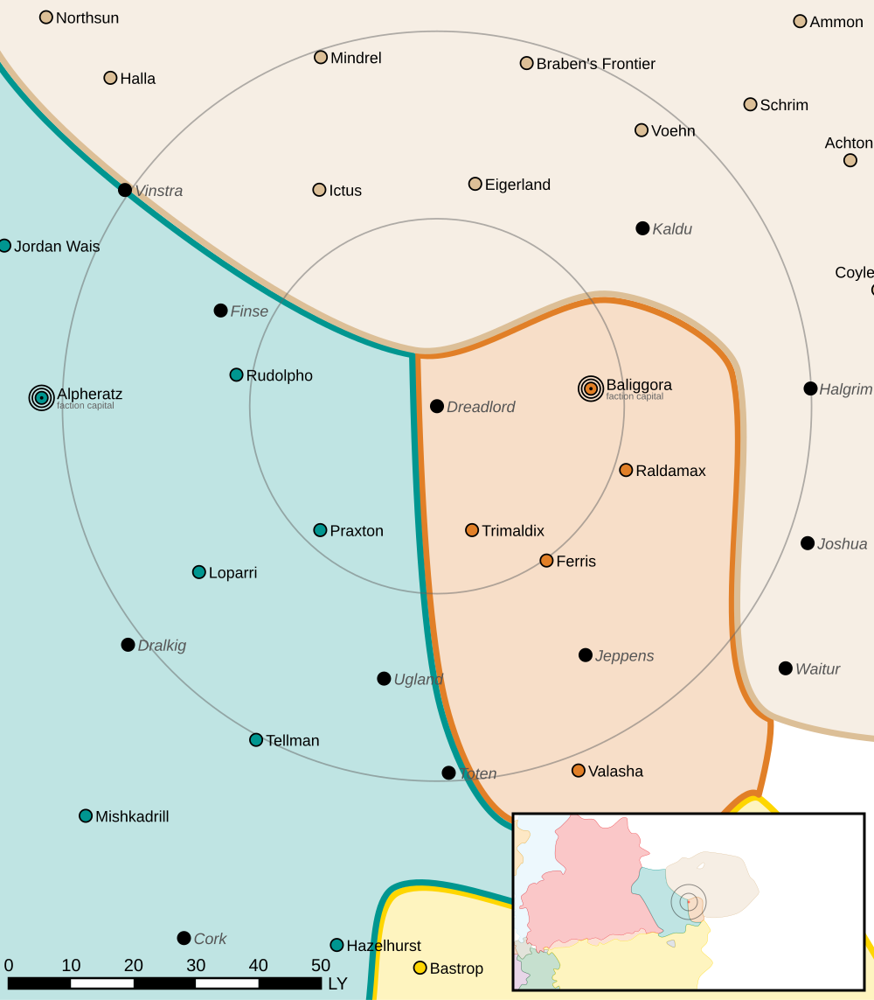

Dreadlord
------------------------------------

This world is considered abandoned.
In 3136, a MIIO team from the Federated Suns created a secret listening post to monitor Clan Snow Raven fleet transmissions.
The Draconis Combine recovered information about the Federated Suns project when they controlled New Avalon.

Intelligence
^^^^^^^^^^^^^^^^^^^^^^^^^^^^^^^^^^^

Status: Abandoned world

Planetary Data
^^^^^^^^^^^^^^^^^^^^^^^^^^^^^^^^^^^

* Sarna: `Dreadlord article <https://www.sarna.net/wiki/Dreadlord>`_
* Planet Type: Terrestrial
* Diameter: 12.900,0 km
* Position in System: 3 (1,000 AU)
* Time to Jump Point: 9,12 days
* Star type: G2V (183 hours)
* Year length: 3,2 Terran years
* Day length: 23,0 hours
* Surface Gravity: 1,01 g
* Atmosphere: Breathable
* Atmospheric Pressure: Standard
* Atmospheric Composition: Nitrogen and Oxygen, plus trace gasses
* Equatorial Temperature: 29C
* Surface Water: 68\%
* Highest Native Life: Insects
* Capital City: Project Urge Argent
* Population: 35
* Socio-industrial Levels:
    * Regressed: Pre-industrial world
    * X: None
    * X: None
    * X: None
    * X: None
* HPG: None
