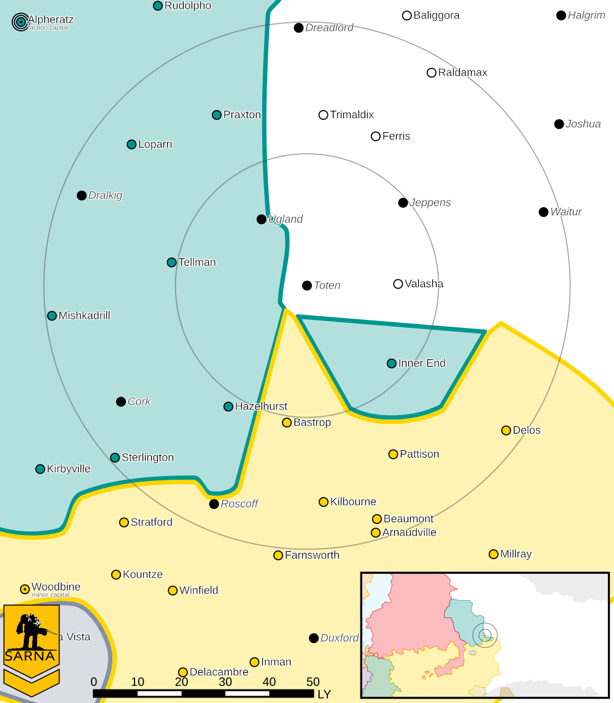

Toten
------------------------------------

This world is considered abandoned.

* Sarna: `Toten article <https://www.sarna.net/wiki/Toten>`_
* Planet Type: Terrestrial
* Diameter: 12.000,0 km
* Position in System: 3 (1,000 AU)
* Time to Jump Point: 8,55 days
* Star type: G3V (184 hours)
* Year length: 1,4 Terran years
* Day length: 27,0 hours
* Surface Gravity: 0,68 g
* Atmosphere: Breathable
* Atmospheric Pressure: Standard
* Atmospheric Composition: Nitrogen and Oxygen, plus trace gasses
* Equatorial Temperature: 36C
* Surface Water: 29\%
* Highest Native Life: Birds
* Capital City: Plevna
* Population: 0
* Socio-industrial Levels:
    * Regressed: Pre-industrial world
    * X: None
    * X: None
    * X: None
    * X: None
* HPG: None
