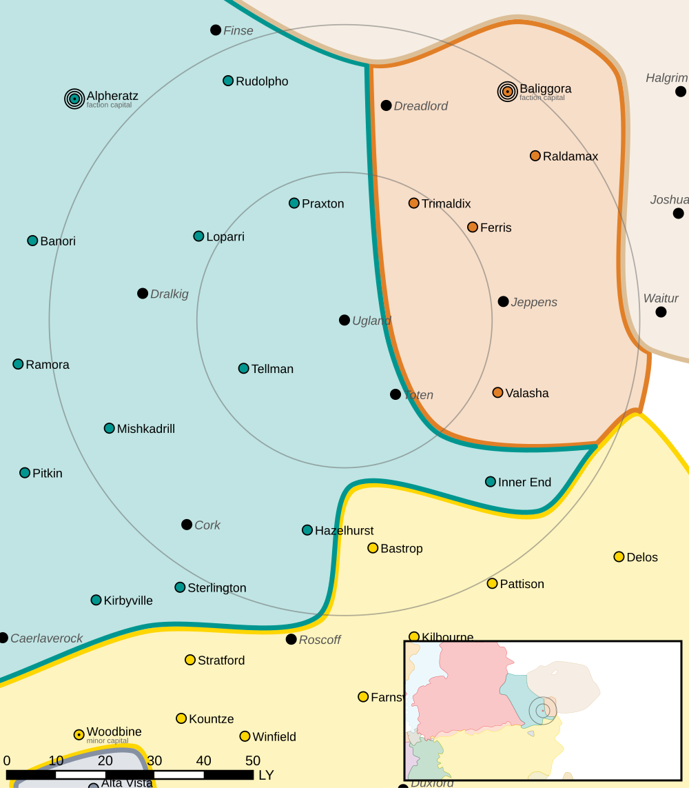

Ugland
------------------------------------

This world is considered abandoned.

Intelligence
^^^^^^^^^^^^^^^^^^^^^^^^^^^^^^^^^^^

Status: Abandoned world

Planetary Data
^^^^^^^^^^^^^^^^^^^^^^^^^^^^^^^^^^^

* Sarna: `Ugland article <https://www.sarna.net/wiki/Ugland>`_
* Planet Type: Terrestrial
* Diameter: 11.700,0 km
* Position in System: 3 (1,200 AU)
* Time to Jump Point: 12,02 days
* Star type: F8V (179 hours)
* Year length: 1,7 Terran years
* Day length: 20,0 hours
* Surface Gravity: 0,88 g
* Atmosphere: Breathable
* Atmospheric Pressure: Standard
* Atmospheric Composition: Nitrogen and Oxygen, plus trace gasses
* Equatorial Temperature: 35C
* Surface Water: 27\%
* Highest Native Life: Birds
* Capital City: Nova Rockcreek
* Population: 0
* Socio-industrial Levels:
    * Regressed: Pre-industrial world
    * X: None
    * X: None
    * X: None
    * X: None
* HPG: None
